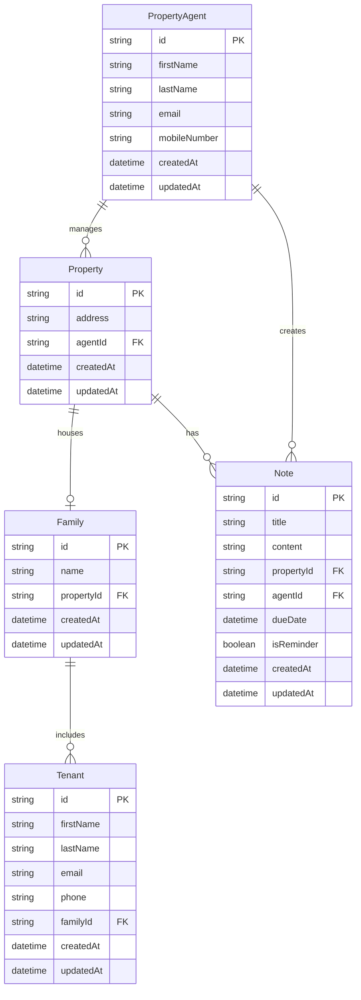

# PURE Home River Data Model

## Entity Relationship Diagram

## Entity Descriptions

### PropertyAgent
Represents a property management agent who manages properties and creates notes.

| Field | Type | Description |
|-------|------|-------------|
| id | string | Unique identifier (UUID) |
| firstName | string | Agent's first name |
| lastName | string | Agent's last name |
| email | string | Agent's email address |
| mobileNumber | string | Agent's mobile phone number |
| createdAt | datetime | Record creation timestamp |
| updatedAt | datetime | Record last update timestamp |

### Property
Represents a rental property managed by an agent.

| Field | Type | Description |
|-------|------|-------------|
| id | string | Unique identifier (UUID) |
| address | string | Property street address |
| agentId | string | Foreign key to PropertyAgent |
| createdAt | datetime | Record creation timestamp |
| updatedAt | datetime | Record last update timestamp |

### Family
Represents a family unit residing at a property.

| Field | Type | Description |
|-------|------|-------------|
| id | string | Unique identifier (UUID) |
| name | string | Family name/identifier |
| propertyId | string | Foreign key to Property |
| createdAt | datetime | Record creation timestamp |
| updatedAt | datetime | Record last update timestamp |

### Tenant
Represents an individual tenant who is part of a family.

| Field | Type | Description |
|-------|------|-------------|
| id | string | Unique identifier (UUID) |
| firstName | string | Tenant's first name |
| lastName | string | Tenant's last name |
| email | string | Tenant's email address |
| phone | string | Tenant's phone number |
| familyId | string | Foreign key to Family |
| createdAt | datetime | Record creation timestamp |
| updatedAt | datetime | Record last update timestamp |

### Note
Represents a note or reminder associated with a property and agent.

| Field | Type | Description |
|-------|------|-------------|
| id | string | Unique identifier (UUID) |
| title | string | Note title |
| content | string | Note content/body |
| propertyId | string | Foreign key to Property |
| agentId | string | Foreign key to PropertyAgent |
| dueDate | datetime | Due date for reminders |
| isReminder | boolean | Whether this note is a reminder |
| createdAt | datetime | Record creation timestamp |
| updatedAt | datetime | Record last update timestamp |

## Relationships

1. **PropertyAgent 1:N Properties** - One agent can manage multiple properties
2. **Property 1:1 Family** - Each property houses one family at a time
3. **Family 1:N Tenants** - A family can have multiple tenant members
4. **PropertyAgent 1:N Notes** - An agent can create multiple notes
5. **Property 1:N Notes** - A property can have multiple notes attached
