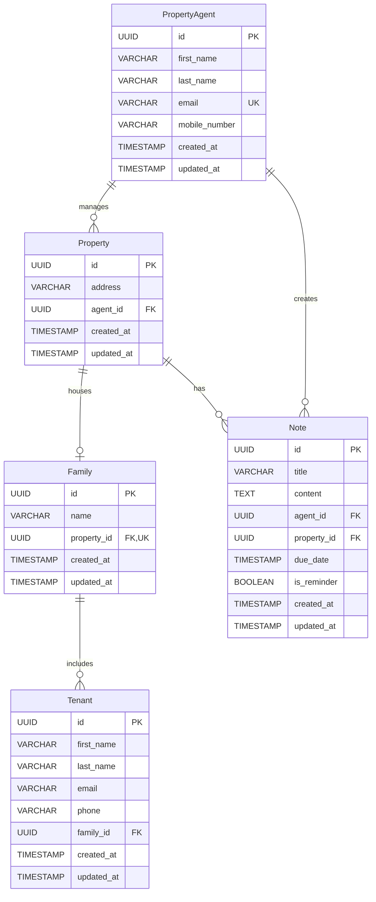

# PURE Home River Data Model

## Entities

### 1. PropertyAgent

| Column | Type | Constraints |
|--------|------|-------------|
| id | UUID | PRIMARY KEY |
| first_name | VARCHAR(100) | NOT NULL |
| last_name | VARCHAR(100) | NOT NULL |
| email | VARCHAR(255) | NOT NULL, UNIQUE |
| mobile_number | VARCHAR(20) | NOT NULL |
| created_at | TIMESTAMP | NOT NULL, DEFAULT NOW() |
| updated_at | TIMESTAMP | NOT NULL, DEFAULT NOW() |

---

### 2. Property

| Column | Type | Constraints |
|--------|------|-------------|
| id | UUID | PRIMARY KEY |
| address | VARCHAR(500) | NOT NULL |
| agent_id | UUID | NOT NULL, FOREIGN KEY → PropertyAgent(id) |
| created_at | TIMESTAMP | NOT NULL, DEFAULT NOW() |
| updated_at | TIMESTAMP | NOT NULL, DEFAULT NOW() |

---

### 3. Family

| Column | Type | Constraints |
|--------|------|-------------|
| id | UUID | PRIMARY KEY |
| name | VARCHAR(200) | NOT NULL |
| property_id | UUID | NOT NULL, UNIQUE, FOREIGN KEY → Property(id) |
| created_at | TIMESTAMP | NOT NULL, DEFAULT NOW() |
| updated_at | TIMESTAMP | NOT NULL, DEFAULT NOW() |

---

### 4. Tenant

| Column | Type | Constraints |
|--------|------|-------------|
| id | UUID | PRIMARY KEY |
| first_name | VARCHAR(100) | NOT NULL |
| last_name | VARCHAR(100) | NOT NULL |
| email | VARCHAR(255) | NULL |
| phone | VARCHAR(20) | NULL |
| family_id | UUID | NOT NULL, FOREIGN KEY → Family(id) |
| created_at | TIMESTAMP | NOT NULL, DEFAULT NOW() |
| updated_at | TIMESTAMP | NOT NULL, DEFAULT NOW() |

---

### 5. Note

| Column | Type | Constraints |
|--------|------|-------------|
| id | UUID | PRIMARY KEY |
| title | VARCHAR(200) | NOT NULL |
| content | TEXT | NULL |
| agent_id | UUID | NOT NULL, FOREIGN KEY → PropertyAgent(id) |
| property_id | UUID | NULL, FOREIGN KEY → Property(id) |
| due_date | TIMESTAMP | NULL |
| is_reminder | BOOLEAN | NOT NULL, DEFAULT FALSE |
| created_at | TIMESTAMP | NOT NULL, DEFAULT NOW() |
| updated_at | TIMESTAMP | NOT NULL, DEFAULT NOW() |

---

## Relationships

| Relationship | Cardinality | Description |
|--------------|-------------|-------------|
| PropertyAgent → Property | 1:N | One agent manages many properties |
| Property → Family | 1:1 | Each property houses one family |
| Family → Tenant | 1:N | One family has many tenants |
| PropertyAgent → Note | 1:N | One agent creates many notes |
| Property → Note | 1:N | One property can have many notes (optional) |

---

## ERD Diagram

---

## Key Design Notes

1. **Family ↔ Property**: The `UNIQUE` constraint on `Family.property_id` enforces one family per property
2. **Note.property_id**: Nullable to allow agent notes not tied to any specific property
3. **Note.is_reminder**: Boolean flag to distinguish reminders (with due dates) from regular notes
